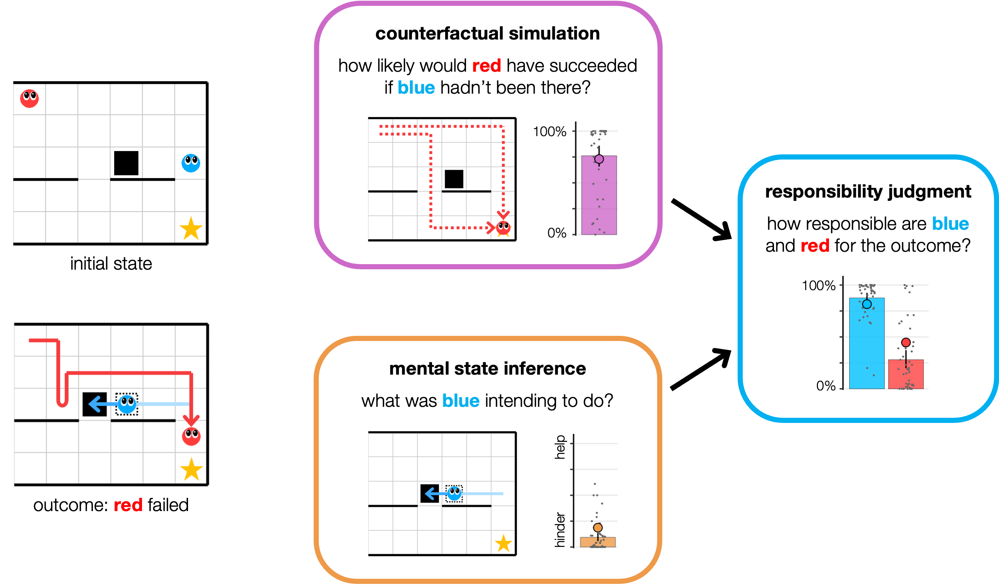
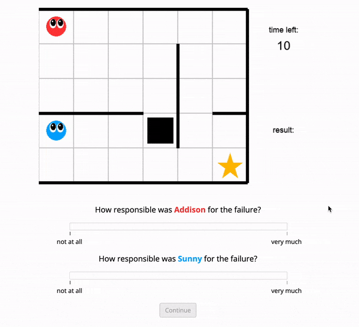

# A computational model of responsibility judgments from counterfactual simulations and intention inferences

This repository contains the models, experiments, data, analyses, and figures
for the paper "A computational model of responsibility judgments from
counterfactual simulations and intention inferences"
by Sarah A. Wu, Shruti Sridhar, and Tobias Gerstenberg.

Presented at the 45th Annual Conference of the Cognitive Science Society
(CogSci 2023), and published in the Conference Proceedings.

```
@inproceedings{wu2023responsibility,
  title = {A computational model of responsibility judgments from counterfactual simulations and intention inferences},
  booktitle = {Proceedings of the 45th {Annual} {Conference} of the {Cognitive} {Science} {Society}},
  author = {Wu, Sarah A. and Sridhar, Shruti and Gerstenberg, Tobias},
  year = {2023},
}
```

__Contents__:
- [Introduction](#introduction)
- [Preregistrations](#preregistrations)
- [Repository structure](#repository-structure)
- [Model usage](#model-usage)


## Introduction

How responsible someone is for an outcome depends on what causal role their actions played, and what those actions reveal about their mental states, such as their intentions. In this paper, we develop a computational account of responsibility attribution that integrates these two cognitive processes: causal attribution and mental state inference. Our model makes use of a shared generative planning algorithm assumed to approximate people's intuitive theory of mind about others' behavior. We test our model on a variety of animated social scenarios in two experiments. Experiment 1 features simple cases of helping and hindering. Experiment 2 features more complex interactions that require recursive reasoning, including cases where one agent affects another by merely signaling their intentions without physically acting on the world. Across both experiments, our model accurately captures participants' counterfactual simulations and intention inferences, and establishes that these two factors together explain responsibility judgments.

<div align="center"></div>


## Preregistrations

Preregistrations for all experiments are available on the Open Science Framework (OSF):
- Experiment 1 - [Counterfactual](https://osf.io/2gekb),
  [Intention](https://osf.io/c5ahj),
  [Effort](https://osf.io/ekw8h),
  [Responsibility](https://osf.io/qvb2a)
- Experiment 2 - [Counterfactual](https://osf.io/u39wh),
  [Intention](https://osf.io/s4edm),
  [Responsibility](https://osf.io/x2qh7),
  [Explanation](https://osf.io/qd6tv)


## Repository structure

```
├── analysis
├── model
├── data
│   ├── experiment1
│   │   ├─── counterfactual
│   │   ├─── intention
│   │   ├─── effort
│   │   └─── responsibility
│   └── experiment2
│       ├─── counterfactual
│       ├─── intention
│       ├─── responsibility
│       └─── explanation
├── docs
│   ├── experiment1
│   │   └─── ...
│   └── experiment2
│       └─── ...
└── figures
    ├── experiment1
    └── experiment2
```

- `analysis` contains all the code for analyzing data and generating figures
      (see a rendered file [here](https://cicl-stanford.github.io/counterfactual_agents/)).
- `model` contains all the code for our environment and model (see usage details below).
- `data` contains anonymized data from all four conditions for each experiment.
  For each condition, `participants.csv` contains demographic information and
  post-experiment feedback/comments from participants,
  and `trials.csv` contains the response data.
- `docs` contains all the experiment code. You can preview the experiments below:
      <div align="center"></div>
    - Experiment 1 - [Counterfactual](https://cicl-stanford.github.io/counterfactual_agents/experiment1/counterfactual/),
      [Intention](https://cicl-stanford.github.io/counterfactual_agents/experiment1/intention/),
      [Effort](https://cicl-stanford.github.io/counterfactual_agents/experiment1/effort/),
      [Responsibility](https://cicl-stanford.github.io/counterfactual_agents/experiment1/responsibility/)
    - Experiment 2 - [Counterfactual](https://cicl-stanford.github.io/counterfactual_agents/experiment2/counterfactual/),
      [Intention](https://cicl-stanford.github.io/counterfactual_agents/experiment2/intention/),
      [Responsibility](https://cicl-stanford.github.io/counterfactual_agents/experiment2/responsibility/),
      [Explanation](https://cicl-stanford.github.io/counterfactual_agents/experiment2/explanation/)
- `figures` contains the two figures from the paper (generated using the script
  in `analysis`) as well as gifs and still images of all the experiment trials.


## Model usage

Make sure you're in the ``model/`` directory and can see ``main.py``. This is the primary file for generating trials and running the simulation models. The basic command structure for running the models on a specific trial is:
```
python main.py --experiment <exp> --trial <trial> --cf --intention --effort
```
where ``<exp>`` specifies either experiment `1` or `2`, and ``<trial>`` is the trial number within that experiment, from `1` to `24`. This flag can be left off to run all 24 trials of the specified experiment. The ``--cf``, ``--intention``, and ``--effort`` flags indicate running the counterfactual simulation, intention inference, and effort models, respectively. Any combination of these three flags can be included. For example, the command to run only the counterfactual model on all 24 trials of experiment 1 is:
```
python main.py --experiment 1 --cf
```
Other flags that can be added:
*   ``--visualize`` will generate step-by-step images and a gif of the specified trial (or all trials), which will be saved in ``model/trials/`` within the corresponding experiment subfolder, under the corresponding trial number.
*  ``--verbose`` will print out step-by-step information about each agent's plan as the trial is being generated.
*  ``--n-simulations <n>`` specifies the number of counterfactual simulations to run, default 500.
